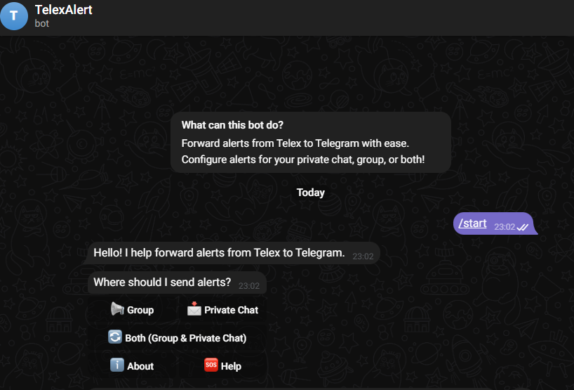

# Telex2Telegram Alert Integration

## Overview
The **Telex2Telegram Alert Integration** is an **Output Integration** for the [Telex platform](https://telex.im) that makes use of a **Telegram Notification Bot**. It forwards messages from a Telex channel to a **Telegram group** or a **specific user**, allowing organizations to receive critical notifications directly on Telegram.

## Features
- 📌 **Flexible Routing:** Send notifications to a Telegram **group**, **user**, or both.
- 🔄 **Seamless Setup:** Simple onboarding with automatic retrieval of user or group IDs.
- ⚡ **Real-Time Forwarding:** Instantly relays messages from Telex to Telegram.
- 🔔 **Custom Notifications:** Organizations can configure which types of messages to forward on the **Telex** channel.
- 📖 **Help & Support:** Users can access setup instructions and request support via the bot.

## Installation & Setup

### Step 1: Add the Bot to Telegram
1. Start the bot in a **private chat** [Here](https://t.me/TelexAlert_bot).
2. The bot will guide you through setup.
3. You would get ID(s) which you will input in the application in Telex integration settings

### Step 2: Configure Notification Preferences
1. Choose between **group notifications**, **personal notifications**, or both.
2. If selecting a **group**, follow these steps:
   - Add the bot to the target group.
   - Use the **Get Group ID** option to retrieve the group ID.
   - Input the group ID into the Telex integration settings.
3. If selecting **personal notifications**, the bot will provide your Telegram User ID instantly.

### Step 3: Link to Telex
1. Add the application Telex2telegram Alerts in the integration marketplace
2. Navigate to your Telex organization settings.
3. Enter your Telegram **User ID** or **Group ID** or Both.
4. Save and enable the integration.

### Step 4: Test the Integration
- Send a test message from Telex to ensure delivery to Telegram.
- Verify that the bot correctly forwards messages.

## Best Use Scenario
- Configure your Telex channel with different monitoring and logging tools, and watch **Telex2Telegram Alert Integration** relay the logs to telegram.

## Support & Troubleshooting
- Use the **Help** option in the bot for assistance.

## Screenshots

 

## License
This project is licensed under the MIT License.

---
**🚀 Ready to streamline your notifications? Add the bot to Telegram today!**

---
🔹 **Author**: Samuel Ayomide  
🔹 **HNG12 Internship**: Stage 3 Backend - Telex Integrations  
🔹 **Year**: 2025 🚀
